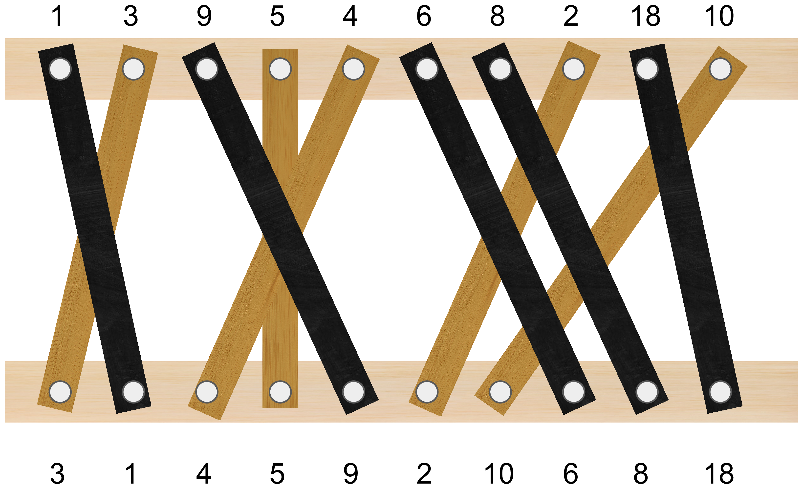
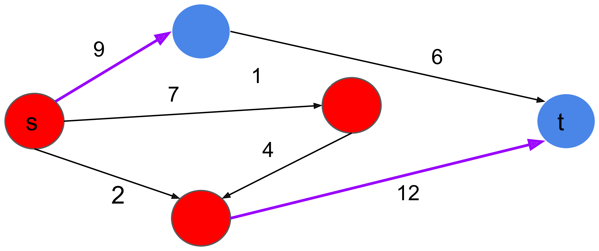
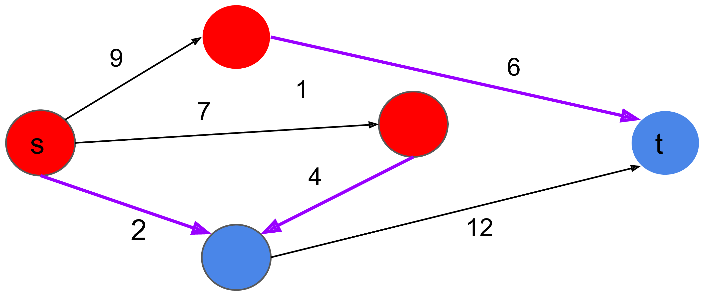
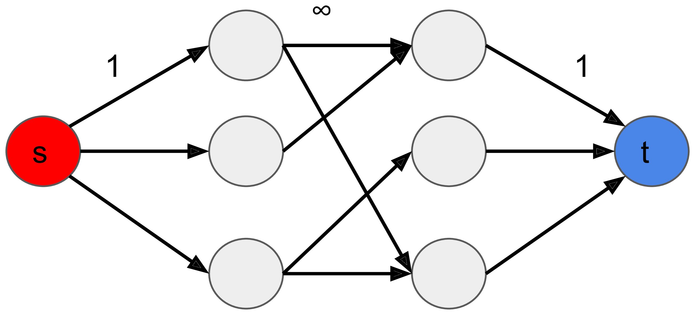

# 2021台灣國際資訊奧林匹亞初選 解說 (2021 TOI入營考 Editorial)

---

## A: 原始人排序

可以用 STL 提供的 stable_sort 再加上自己手寫的 compare function:

```c++
stable_sort(ar, ar+n, [](int x,int y) {
  return __builtin_popcount(x) < __builtin_popcount(y);
});
```

其中:

- stable_sort 在兩數字等於的時候不會修改原序列的順序
- __builtin_popcount 會回傳二進位中 1 的個數

---

## B: 掃地機器人

預設解法：

- subtask1: O(mn log n)
- subtask2: O(n<sup>2</sup> log S)

----

### 觀察

1. 機器人只往右走不會比較差 (來回走會造成時間浪費)
  - 如果機器策略是【掃1分鐘教室1】 ⇨ 【掃2分鐘教室2】  ⇨ 【掃1分鐘教室1】，那不如一開始就掃教室1掃2分鐘。
2. 機器人最終停在哪個教室不一定
3. 由以上兩點，可以得知機器人花在移動的總時間是由終點決定的
  - 如果最後停在教室 e，那麼**可以花在掃除的時間**為 m - t<sub>1</sub> - t<sub>2</sub> - … - t<sub>e-1</sub>

----

### 做法1

「如果最後停在教室 e，那麼可以掃除的總時間為 k = m - t<sub>1</sub> - t<sub>2</sub> - … - t<sub>e-1</sub>」

- 為了最大化蒐集到的灰塵量，要將剩下的 k 分鐘分給前 e 個教室
- 每個教室第一次掃除的灰塵量最大，接下來會慢慢減少
  - 所以將每一分鐘貪心地分給目前蒐集得到灰塵量最大的教室就好

可以得到以下算法：

- 枚舉終點 e，以及求出剩下可以打掃的時間 k
- 終點 e 固定的情況下，將第 1 ~ k 分鐘分別分給目前蒐集得到灰塵量最大的教室
- 可以用一個 heap/priority_queue 來維護 e 個教室中目前掃得到最多的灰塵量
- 對每個終點需要花 O(m log n) 維護，複雜度為 O(nm log n)

----

```c++
// 扣掉移動時間後，有 k 分鐘打掃前 e 個教室最大蒐集灰塵量
long long collect_dust(int e, int k) {
  priority_queue<pair<int,int>> pq; // 維護 (目前蒐集得到的灰塵量, 教室id)
  long long result = 0;

  for (int i=1; i<=e; i++) {
    pq.emplace(s[i], i);
  }
  for (int t=1; t<=k; t++) {
    if (pq.empty()) break; // 所有 >= 0 的灰塵都被掃完了

    int dust, classroom;
    tie(dust, classroom) = pq.top();
    pq.pop();

    result += dust;
    if (dust - d[classroom] > 0) { // 下一次掃除的灰塵量 > 0 的話
      pq.emplace(dust - d[classroom], classroom);
    }
  }
  return result;
}
```

----

### 做法2

跟做法 1 一樣考慮固定走到教室 e 的情況

- 特別考慮 k 分鐘裡面，掃到最少灰塵的那一分鐘
- 假設最少那一分鐘掃到的灰塵量為 x，在最佳的策略裡：
  - 前 e 間教室裡，灰塵量 > x 的所有分鐘都被掃完了
  - 前 e 間教室裡，除了所有 > x 的分鐘以外還多掃了一些灰塵量 = x 的分鐘

----

對於一個灰塵量 x，可以統計教室裡可以掃到這個灰塵量的總分鐘數：

- 假設前 e 間教室總共有 a 分鐘可以掃到 > x 的灰塵量
- 假設前 e 間教室總共有 b 分鐘可以掃到 = x 的灰塵量
- 對於可以分配在掃除時間的 k 分鐘會有兩種情況
  1. 所有 > 0 的灰塵量都被掃完，意思是掃除總時間不一定掃滿 k 分鐘
  2. 否則代表這 k 分鐘都用在掃除，必定會滿足 $a < k \le a+b$
- 對於狀況 1 可以分開考慮，因為只要把所有正個灰塵量加總就可以得到答案

----

給一個終點 e，灰塵量 x，可以 O(n) 算出對應的 a 和 b

```c++
using PLL = pair<long long,long long>;

PLL dust_to_time(int e, int x) {
  long long a = 0, b = 0;

  for (int i=1; i<=e; i++) if (s[i] >= x) {
    if (d[i] == 0) {
      return PLL (LLONG_MAX, LLONG_MAX);
    }

    a += (s[i] - x) / d[i] + 1;
    if (s[i] % d[i] == x % d[i]) { // 最小的那分鐘剛好掃到的灰塵量是 x
      b++;
      a--;
    }
  }
  return PLL(a, b);
}
```

----

注意到 (a, a+b) 都會隨著搜索的 x 遞增而遞減。因此可以二分搜索 x

- 枚舉終點 e，以及可以掃除的時間 k
- 二分搜索一個最小要掃的灰塵量 x
  - 如果 a<sub>x</sub> + b<sub>x</sub> ≥ k，往大的 x 搜索
  - 否則往小的 x 搜索

每次二分搜索的時間複雜度為 O(n log S)，乘以 n 個終點，為 O(n<sup>2</sup> log S)。


---

## C: 粉刷護欄

預設解法:

- subtask1: 搜索
- subtask2: O(n<sup>2</sup>) DP
- subtask3: O(n log n) DP

----

### subtask1

枚舉所有選木板的 2<sup>n</sup> 種可能，每次花 O(n) 檢查選的木板集合是不是合法。

複雜度: O(2<sup>n</sup> × n)

----

### subtask2

- 這裡稱「第 i 塊木板」代表上面第 i 個釘子的木板。並且第 i 塊木板的編號是 a<sub>i</sub>
- 定義一個數列 w：w<sub>i</sub> = 上面第 i 個釘子，連到下面的木樑第 w<sub>i</sub> 個釘子
  - 如下圖，w = [2, 1, 5, 4, 3, 8, 9, 6, 10, 7]
- 選的木板互不交叉 ⇒ 選的木板對到 w 的子序列遞增
  - 例如答案是選第 1,3,6,7,9 塊木板，對到的 w 子序列是 [2, 5, 8, 9, 10]
- 選的木板數最多 ⇒ w 的最長遞增子序列 (LIS)




----

正式一點來定義這個問題：

- 「第 i 塊木板」代表上面第 i 個釘子的木板，木板 i 的編號是 a<sub>i</sub>，連到下面第 w<sub>i</sub> 個釘子
- 問題等於選一個整數數列 $f_1, f_2, \ldots f_k$，並滿足
  - $1 \le f_1 < f_2 < \ldots < f_k \le n$
  - $w_{f_1}, w_{f_2}, \ldots w_{f_k}$ 遞增，且 k 最大
  - 在 k 最大的情況下，$a_{f_1}, a_{f_2}, \ldots, a_{f_k}$ 字典序越大越好

如果只求 k 的值就是單純的求 LIS 長度，但因為這裡有字典序最大的條件會稍微複雜一點

----

### DP

- dp[i] = 若第一塊木板選 i，最多可以選幾塊木板
- nxt[i] = 若第一塊木板選 i，選木板最多且字典序最大的情況下下一個木板該選哪個
  - 若 nxt[i] = j，則有 dp[j] = dp[i] - 1
  - 換句話說 j 是 i 右邊 dp 值剛好少 1，且對應到編號最大的木板

```c++
for (int i=n; i>=1; i--) {
  dp[i] = 1;
  nxt[i] = -1;
  for (int j=i+1; j<=n; j++) if (w[j] > w[i]) {
    if (dp[j] == dp[i]-1 && a[j] > a[nxt[i]]) { // 一樣長，比字典序
      nxt[i] = j;
    } else if (dp[j]+1 > dp[i]) { // 更長，直接更新最佳解
      dp[i] = dp[j] + 1;
      nxt[i] = j;
    }
  }
}
int k = *max_element(dp+1, dp+n+1);
```

還原解的時候起點是 dp 值 = k 且 a 值最大的那個。複雜度為 O(n<sup>2</sup>)

----

### subtask3

- dp 表格的 O(n log n) 求法是很經典的問題，可以參考 [ref1](https://www.cs.princeton.edu/courses/archive/spring13/cos423/lectures/LongestIncreasingSubsequence.pdf) 或 [ref2](https://www.geeksforgeeks.org/maximum-sum-increasing-subsequence-using-binary-indexed-tree/)
- nxt[i] = $\mathop{\rm argmax}\limits_{j: w_j > w_i \\\\ dp[j]=dp[i]-1} a[j]$

nxt 有不少 ad-hoc 的求法，這裡介紹其中一種

- 對每個 dp 值開一個陣列紀錄滿足這個 dp 有的 (w, a)
- 可以在陣列中二分搜索，或者用樹狀結構來維護
  - 二分搜索的註解: 因為同一個 dp 值裡，w 越大 a 越大會越會成為 nxt 的值。所以可以用單調隊列維護隨著 w 增加 a 遞減的單調數列
- 在求出 dp 表格後，可以 O(n log n) 再求出 nxt 表格

---

## D: 乘車時間

預設解法

- subtask1: BFS/DFS
- subtask2: 倍增法 or 其它可以求 LCA 的方法
- subtask3: 區間資料結構(線段樹)
- subtask4: 樹DP + 倍增法

這題的部分分不好拿，除了 subtask4 以外都互相不包含其它 subtask 的做法，得分開實作。

----

### subtask1

對於每筆詢問，可以 BFS/DFS O(n) 處理。注意換車的時候小心處理下次能坐到車的時間即可。

複雜度 O(qn)

----

### subtask2

「每個整數分鐘都會發車」，也就是說不需要考慮轉車完但車子還沒來的情況。
因此答案會等於「經過的邊權總和 + 經過點數 - 1」。
其中 (經過點數-1) 是所需的換車時間。

這個問題答案可以透過求樹上 LCA(最近共通祖先) 順便得出，有不少的作法這裡就省略解釋了。
推薦讀者至少要會[基於倍增的作法](https://www.topcoder.com/thrive/articles/Range%20Minimum%20Query%20and%20Lowest%20Common%20Ancestor#10) (參見 "Another easy solution in <O(N logN, O(logN)>" 一節)。

複雜度 O(n log n + q log n)

----

### subtask3

給定的路線網為一條線。從這個 subtask 開始需要考慮出發時間的性質：

- 從 x 出發到 y，不同時間出發所花的時間不盡相同 (出發時間會影響答案)
- 同一時間從 x 出發到 y 與 y 出發到 x，所花的時間也不一定相同 (方向會影響答案)

----

將所花的時間分成乘車、轉車、等車三個部份考慮。
考慮某個從 x 到 y 的路線，可以發現任意時間出發花在轉車以及乘車的時間是固定的，造成費時不同的主因是等車的班距。舉個例子:

- 假設前一班車每 2 分鐘一班，後一班車每 3 分鐘一班
- 這時候針對前一班車到達時間 % 3，會有 3 種不同的情況
  - 到達時間 % 3 == 0： 加上一分鐘轉乘以後，需要多等2分鐘才能搭下一班車
  - 到達時間 % 3 == 1： 加上一分鐘轉乘以後，需要多等1分鐘才能搭下一班車
  - 到達時間 % 3 == 2： 加上一分鐘轉乘以後，需要多等0分鐘才能搭下一班車
- 上面問題複雜的地方： 我們知道到達時間 % 2 是多少，但到達時間 % 3 並不固定，所以會需要考慮三種可能

觀察：如果所有車的班距都一樣(前後一班車都是 3 分鐘一班)，好像就只需要考慮一種可能了?

----

- 再觀察一次題目的條件：1 ≤ p<sub>i</sub> ≤ 6
- 「我們知道到達時間 % 2 是多少，但到達時間 % 3 並不固定，所以需要考慮多種可能」
- 反過來說，如果我們知道出發時間分別 mod 1,2,3,4,5,6 的值，後面等車的時間就固定了
- 出發時間只需要考慮 lcm(1, 2, …, 6) = 60 種可能

----

算法:

- 維護 (i, j, t) 代表 i 出發到 j 所花的時間，且出發時間 mod 60 = t
- 由於給定的圖為一條線，上面的 i,j 可以用一棵線段樹來維護
- 要注意的是 (i < j) 和 (i > j) 的情況要分開維護，因此我們會需要兩棵線段樹，一棵維護往右走需要花的時間，一棵維護往左走的時間

複雜度 O(n log n + q log n)

----

### subtask4

首先任意找一個樹根，合併 subtask2 的倍增作法以及 subtask3 處理出發時間的方法，可以維護以下的 DP:

- up[i][x][t]: 從 x 開始，在時間 mod 60 = t 出發，往上(根方向)搭 2<sup>i</sup> 次車所需要花的時間
- down[i][x][t]: 從 x 上面 2<sup>i</sup> 層的點開始，在時間 mod 60 = t 出發，往下(葉子方向)搭車到 x 所需要花的時間

要特別小心處理的是 down 和 up 的 DP 方法並不太一樣。
維護表格的大小為 log n × n × 60，每次查詢可以在 O(log n) 得到解答。複雜度為 O(n log n + q log n)

---

## E: 密室逃脫

建議看此題解法前的預備知識：

- [最大流](https://en.wikipedia.org/wiki/Maximum_flow_problem)、[最小割](https://en.wikipedia.org/wiki/Cut_(graph_theory))、[二分圖最大匹配](https://www.geeksforgeeks.org/maximum-bipartite-matching/)
- 二分圖帶權匹配、[最小/最大費用流](https://en.wikipedia.org/wiki/Minimum-cost_flow_problem)
- [Kőnig's theorem](https://en.wikipedia.org/wiki/K%C5%91nig%27s_theorem_(graph_theory))
- [差分約束](https://zh.wikipedia.org/wiki/%E5%B7%AE%E5%88%86%E7%BA%A6%E6%9D%9F%E7%B3%BB%E7%BB%9F)

----

### E - 解法一覽

- 二分圖一般匹配 / maxflow - mincut
  - A<sub>i,j</sub> ≤ 1 的情況
- 最小/最大費用流
  - O(n<sup>4</sup>)
  - O(n<sup>3</sup>) potential function 優化
- 匈牙利算法
  - O(n<sup>3</sup>)

----

### E - subtask 配分

- 寫得出二分圖一般匹配作法可以拿前兩個 subtask 分數
- 寫出任意一種 O(n<sup>4</sup>) 帶權匹配作法，可以拿前三個 subtask 分數
- 再更進一步寫出 O(n<sup>3</sup>) 帶權匹配作法，可以多拿最後一個 subtask (多拿5分)
- 無法輸出可行解的方案 => 分數 \* 0.4

---

## E - 一般二分圖匹配解法

建一張二分圖 G=(X,Y,E)，X, Y 各有 n 個點。其中

- 若 A<sub>i,j</sub> = 1，則 X<sub>i</sub> 和 Y<sub>j</sub> 間建一條邊
- 若 A<sub>i,j</sub> = 0，則 X<sub>i</sub> 和 Y<sub>j</sub> 間沒邊

用二分圖最小覆蓋的概念來解題，把「選點」進最小覆蓋集合這個動作看成

- 選 X<sub>i</sub> 代表第 i 列發射一次
- 選 Y<sub>j</sub> 代表第 j 行發射一次
- 所有 $A_{i,j}=1$ 的地方至少對應的行/列要有發射 ⟺ 每條邊的兩接點至少要有一個點被選進覆蓋集合
- 發射總次數 = 選點的數量，並且要求越小越好

可以看出 A<sub>i,j</sub> ≤ 1 時這題跟二分圖最小覆蓋完全等價。[USACO Asteroids](https://tioj.ck.tp.edu.tw/problems/1089) 就是一個例子。

----

根據 [Kőnig's theorem](https://en.wikipedia.org/wiki/K%C5%91nig%27s_theorem_(graph_theory))，二分圖最小點覆蓋 = 二分圖最大匹配，兩者互為 Primal-Dual 問題。

因此這題最小點覆蓋可以用一般二分圖匹配或 flow 來計算，現在剩下的問題是如何輸出可行解方案。下面將用最小割的角度來解釋如何得出可行解

----

### s-t Cut

**[定義]** 一張帶邊權的有向圖 G=(V,E)，我們可以把點集 V 分成兩個互斥的集合 S,T。定義 G 的 s-t 割 C=(S,T) 滿足：

- $S \cup T = V$，且 $S \cap T = \emptyset$
- $s \in S$ 且 $t \in T$，其中 s, t 為兩個給定的點

另外我們可以定義割邊：

- 若有向邊 $(x, y) \in E$ 且 $x \in S, y \in T$，則稱 (x, y) 為 C 的割邊
- C 的割權重 = 所有割邊邊權總和

最小權重的 s-t 割被稱為「最小 s-t 割」。根據 max flow - min cut theorem，從 s 到 t 的最大流與它的最小 s-t 割答案是相等的。

----



紅色=S點集，藍色=T點集。上面割權重 = 9+12 = 21。

----



割權重 = 6+4+2 = 12。是最小的割。

----

### 最大二分匹配 → 最大流

由於這個模型很常見這裡就省略說明了。注意這裡用的模型中間流量是無限大不然會影響找解的正確性，理由在之後的頁面會說明



----

### 最小點覆蓋 → 最小割

- 左邊的點若在S集合=不選進覆蓋集合，T集合=選
- 右邊的點若在S集合=選進覆蓋集合，T集合=不選
- 對於中間邊，如果左邊S右邊T會割到無限大的邊，在最小割權重小於無限的情況不會發生
    - ⇒　每條邊兩端點至少有一個點是在覆蓋集合
- 左邊如果是T(選)，則會割到 1 的邊
- 右邊如果是S(選)，也會割到 1 的邊
- 因此割的大小=選了多少點，最小割 = 最小頂點覆蓋。


注意: 雖然說中間邊權設 1 跑出來的最大匹配數量是對的，但從最小割的觀點來說這個模型是錯的，並且在找對應最小覆蓋解的時候也會出錯。

----

### 最大流 → 最小割

**[定理]**: 若 C(S, T) 是一個 s-t 割，則滿足

1. 在殘流網路(residual network)裡，S 集合沒有連向 T 的出邊
2. 在殘流網路裡，T 沒有 S 連過來的入邊

換句話說: S 到 T 的邊都應該是流滿的。根據上面的定理，我們可以從最大流的殘流網路裡找到對應的割

----

### 最大流 → 最小割

**[性質]**:

- 如果某個點 $x \in S$，若殘流網路 x 連得到 y，則 y 也一定是 S
- 如果某個點 $y \in T$，若殘流網路 x 連得到 y，則 x 也一定是 T

牛刀小試: 給一張二分圖以及他的最大匹配。找出一個字典序最小的最小點覆蓋([UTPC 2013, K](https://atcoder.jp/contests/utpc2013/tasks/utpc2013_11))

----

由上面的定理及性質，我們可以在求出二分匹配之後推出原本最大流作法的殘流網路，並推算出最小割的集合以及每個點是否在最小覆蓋裡面。

----

### 另解: 2-SAT

由於每個匹配邊的兩端點只會**恰好有一點**在最小覆蓋的集合裡面，我們可以利用這個性質來建出 2-SAT 的模型。這個模型對應到的解也會是最小點覆蓋。簡單的建模：

- 若一頂點 x 被選進最小覆蓋集合，則與它匹配的點 π(x) 必定不會被選到集合裡
- 若一頂點 x 沒被選進最小覆蓋集合，則與它相鄰的所有點必定會被選到集合裡

2-SAT 要判斷有無解比較簡單，但要輸出可行解則會複雜很多。可以參考 POI 的 [peaceful commission](http://acm.hdu.edu.cn/showproblem.php?pid=1814)
([PL](https://szkopul.edu.pl/problemset/problem/PaOm0b0Z7CvBDSQxwd1ItSP8/site/?key=statement))。

---

## E - 費用流與匈牙利解法

Outline:

- 匈牙利
- 費用流解法與 potential function
- 其它可行解求法 (差分不等式)

----

在邊沒有帶非負權的情況下，這題的所求和最大帶權的二分匹配相等。有兩種方法可以理解這個問題：

1. [Egerváry's theorem](https://en.wikipedia.org/wiki/K%C5%91nig%27s_theorem_(graph_theory)#Egerv%C3%A1ry's_theorem_for_edge-weighted_graphs)：w-vertex cover 和 w-weight matching 恰為線性規劃的對偶問題
2. 匈牙利算法的過程中，w-vertex cover 滿足的條件與算法中每個點的 label 條件相同

又因為這題是完全二分圖且有 $A_{i,j} \ge 0$ 的限制，因此最大權二分匹配 = 最大權完美二分匹配。

----

### 匈牙利解法

題目定義的行、列可行解剛好就是匈牙利算法中 feasible label 的定義，直接輸出 labeling 就是一組可行解了

要注意的是要解最後一個子題時間要求到 $O(n^3)$，網路上有不少模板都是 $O(n^4)$ 的作法。

----

### 費用流解法

套用之前二分匹配做法的最大流模型，並為中間的邊加上輸入矩陣的 cost。可以發現二分圖的帶權匹配與最大費用流等價，這個模型也很常見所以在這裡就不多做解釋了。
但目前還有兩個問題尚未解決：

1. 一般的最小/最大費用流作法是 $O(n^4)$，這對最後一個 subtask 來說並不夠快
  - $O(n^4)$ 的細項: 需要做 $O(n)$ 次最短路增廣，每次增廣要花 $O(\|V\|\|E\|) = O(n^3)$ 的時間。
2. 輸出可行解的方案

為了解決上面兩個問題，下面會介紹一個稱為 potential 的概念。

----

### Potential - 定義

給定一張無負環的邊帶權圖 $G = (V, E, w)$，我們說 $\pi$ 是 G 的一個合法的 potential function 代表它滿足以下條件：

- $\pi: V \rightarrow w$
- 若 $(x, y) \in E$，滿足 $\pi(x) + w_{x,y} - \pi(y) \ge 0$

**[性質]**：令 $\delta_s(x)$ 為某一頂點 s 為起點至 x 的最短距離，若 s 可以連通到所有點，則 $\delta_s$ 是一個合法的 potential function。

**[說明]**：由三角不等式可以得知，對任意邊 $(x, y) \in E$ 有 $\delta_s(x) + w_{x,y} \ge \delta_s(y)$，移向可以得到與定義相同的結論。

----

### Potential - 應用

定義: $\pi(x) + w_{x,y} - \pi(y) \ge 0$

- 可以利用這個式子將所有邊權調整成非負：$w^{\prime}\_{x,y} = w\_{x,y} + \pi(x) - \pi(y) \ge 0$
- 在調整完邊權後的路徑，可以快速找回原圖對應的路徑長
  - 令路徑為 $(v_1, v_2, \ldots, v_k)$，調整後路徑長為 $(\pi(v_1) + w_{v_1, v_2} - \pi(v_2)) + (\pi(v_2) + w_{v_2, v_3} - \pi(v_3)) + \ldots + (\pi(v_{k-1}) + w_{v_{k-1}, v_k} - \pi(v_k))$
  - = 原圖路徑長 $+ \pi(v_1) - \pi(v_k)$
  - 因此不需要知道中間經過的點，只需要經過起點、終點以及其對應的 potential 值就可以在調整前/後圖中的路徑長做對應

----

### Potential - 應用2

一個很有名的應用是可以用來求所有點對最短路的 [Johnson's algorithm](https://en.wikipedia.org/wiki/Johnson%27s_algorithm)

- 首先，先用 Bellman-Ford 做任意一起點的最短路，得出 potential function
- 再來利用 potential function 將所有邊權調成非負，可以用 Dijkstra 計算其它起點的最短路
- 需要做一次 Bellman 以及 n-1 次 Dijkstra，費時 $O(nm \log n)$

概念上是因為做非負權最短路的 Dijkstra 比負權最短路算法的 Bellman-Ford/SPFA 還要快許多。
因此這裡選擇只做一次 Bellman-Ford 將所有邊權調整成非負，其它次的最短路用 Dijkstra 來加速。

類似地，也可以用相同的概念在稀疏圖上得到找最小環 $O(nm \log n)$ 的結果，並且在 2016 年這個算法被改進到 O(nm)。
([link1](https://dspace.mit.edu/handle/1721.1/116243), [link2](http://www.optimization-online.org/DB_FILE/2016/02/5321.pdf))

----

### Potential - 費用流應用

和全點對的最短路一樣，最小費用流也需要透過多次最短路來增廣流量。但有幾個問題存在：

- 之前的 potential function 是用最短路來定義的，所以這裡只考慮最小費用流的情況
  - 題目所求雖然為最大費用流，但只要將所有邊權 * -1 就可以簡單轉成最小費用流
- 難點是在做增廣路的時候，增廣前的殘流網路與增廣後的殘流網路邊集會不一樣
  - 每次增廣後，流滿的邊會被從殘流網路中移走，某些被增廣的反向邊則會被加進殘流網路 (有加減邊的情況)
  - 要怎麼快速維護增廣後合法的 potential，是這個解法的關鍵

----

**[引理]**: 對一網路 G=(V,E)，令 $G_f$ 為增廣數次後的最小費用流的殘流網路，
且殘流網路經過 potential function $\pi$ 調整後的邊權為 $a_{\pi}(e) \ge 0$ $(\forall e \in E_f)$。
對所有 $v \in V$ 令 $\delta_{\pi}(v)$ = 從 s 出發經調整後邊權 $a_{\pi}$ 走到 $v$ 的最短路。
若 $G_f$ 經由某條最短路增廣殘流網路變成 $G_{f^{\prime}}$，則 $\pi^{\prime} = \pi + \delta_{\pi}$ 是 $G_{f^{\prime}}$ 合法的 potential function。

**[證明]**: 對 $G_{f^{\prime}}$ 的所有邊 $e = (u, v)$ 及新調整的權重 $a_{\pi^{\prime}}(e) = a_{\pi}(e) + \delta_{\pi}(u) - \delta_{\pi}(v)$，
考慮以下兩種情況：

1. 若 $e \in E_f$ (增廣前就有的邊)，那麼由原圖的三角不等式可得  $a_{\pi}(e) + \delta_{\pi}(u) - \delta_{\pi}(v) \ge 0$
2. 若 $e \notin E_f$ (e是增廣後才多出來的反向邊)，那可以知道對應的反向邊 $\overleftarrow{e} = (v, u)$ 必定是增廣前最短路的一條邊
  - 由最短路定義，可得 $\delta_{\pi}(v) + a_{\pi}(\overleftarrow{e}) = \delta_{\pi}(u)$
  - $a_{\pi^{\prime}}(\overleftarrow{e}) = a_{\pi}(\overleftarrow{e}) + \delta_{\pi}(v) - \delta_{\pi}(u) = 0$
  - $a_{\pi^{\prime}}(e) = - a_{\pi^{\prime}}(\overleftarrow{e}) = 0$

----

最小費用流的算法:

- 首先先針對原有的網路用 Bellman-Ford 做一次最短路，求出初始的 potential
  - 註: 因為原題給定所有邊權都非負(*-1變最小費用流後都非正)，其實也不一定要用 Bellman 求
- 接著每次用 Dijkstra 在調整權重後的圖做增廣路
- 每增廣一條路，要更新 potential = 原 potential + 新求出的最短路權重

上面算法需要執行 O(n) 次 Dijkstra 與一次 Bellman-Ford。其中 Dijkstra 用 priority_queue 實作的複雜度為 $O(n^2 \log n)$，
但考慮到給定的圖為稠密圖，可以省略 priority_queue 直接用迴圈枚舉距離最小的點，複雜度變為 $O(n^2)$。

因此這裡得到了一個 $O(n^3)$ 的算法。(註: $O(n^3 \log n)$ 是預設會超時的)

----

### 最小費用流 → 找解

考慮做完所有增廣路後的殘流網路 $G_f = (V_f, E_f)$，以及 $A_{i,j}$ 所對應的邊 $e = (u, v, -A_{i,j})$，最後的 potential $\pi$ 及調整後的權重 $a_{\pi}$。

- 若 e 不是匹配邊，則 $e \in E_f$，有 $a_{\pi}(e) = -A_{i,j} + \pi(u) - \pi(v) \ge 0$
- 若 e 是個匹配邊，則 $\overleftarrow{e} = (v, u, A_{i,j}) \in E_f$，有 $a_{\pi}(\overleftarrow{e}) = A_{i,j} + \pi(v) - \pi(u) \ge 0$
- 無論是上面哪個情況，都可以得到 $\pi(u) + (-\pi(v)) \ge A_{i,j}$ 的結論

因此找完解之後的 potential function，將二分圖中右邊點的 potential * -1 就是題目所求的 w-覆蓋方案了。

----

### 可行解的其它求法

假設找到一組可能是負數的可行解 $\\{r_i\\}$ 與 $\\{c_i\\}$ 那麼：

- 因為給定的圖是完全二分圖，所以 $\\{r_i + x\\}$，$\\{c_i - x\\}$ 也是一組可行解
- 因為完全圖邊權都非負，所以如果有一個 $r_i < 0$，則所有 $c_i > 0$
  - 因為 $r_i + c_j \ge A_{i,j}$，且 $A_{i,j} \ge 0$
- 由上面兩點，我們可以把一個有存在負數的可行解透過平移調整成皆非負滿足題目輸出條件

----

可行解的條件: $r_i + c_j \ge A_{i,j}$

- 令 $c^{-}\_j = - c\_j$，代入上式可以得到 $r\_i - c^{-}\_j \ge A\_{i,j}$
- 上述的式子移項後會是很多[差分不等式](https://zh.wikipedia.org/wiki/%E5%B7%AE%E5%88%86%E7%BA%A6%E6%9D%9F%E7%B3%BB%E7%BB%9F)的聯立
- 用 Bellman-Ford 解完差分不等式，可以得到一組可能有負數的可行解
- 再利用上一頁的性質，將可行解調成非負

----

### 可行解整理

- 匈牙利的 feasible label
- potential function
- 差分約束

上面三個算法其實殊途同歸，有興趣的讀者可以想想看這三種算法之間的關係

---

### 小故事: 測資

為了要讓優化過的 SPFA 和 $O(n^4)$ 匈牙利能順利超時，有幾筆測資是這樣生成的:

```c++
for (int i=1; i<=n; i++) {
  for (int j=1; j<=n; j++) {
    if (i<=j) {
      a[i][j] = 4*n*n + (j-i)*(j-i);
    } else {
      a[i][j] = random.randint(0, n*n);
    }
  }
}
```

通常 online judge 上二分圖帶權匹配的題目用 $O(n^4)$ 作法都可以過，
建議寫模板的時候可以多測這筆測資做參考

----

### 存邊

通常存稀疏圖邊有兩種知名的方法，第一個是用 vector:

```c++
vector<Edge> e[M];
void add_edge(int a, Edge x) {
  e[a].push_back(x);
}
```

另一個是俗稱前向星的鏈表儲存方式：

```c++
Edge e[M];
void add_edge(int a, Edge x) {
  e[eid] = x;
  e[eid].next = first[a]; first[a] = eid++;
}
```

這題有 tester 實作了一份非常慢的前向星 + potential 優化費用流解，
在實測時這份解跑的比 vector 存邊還要慢了至少 15 倍以上。
因為實在慢到快跟 $O(n^4)$ 的解一樣了就只好讓這份解 TLE 了。
這是少數理論複雜度正確但卻會超時的例子，
同時也是最後一個 subtask 配分很低的主要原因之一。

----

更詭異的一點是，當測試時把 judge worker 降到 1 以後 (取消平行 judging)，
其它解執行時間並沒有明顯的差異，
但這個原本慢 10 多倍的解突然變成只慢 2 倍左右了。
造成這樣現象的原因雖然沒有很確定，但推測應該是跟 CPU locality cache 以及平行 judge 造成 hit rate 太低有關係，
因為用鏈表存的時候記憶體並不連續。
類似地，這次的 D 其實也有一樣的問題：

```c++
int dp1[16][N][60];
int dp2[N][60][16];
```

經比較這兩種表格的開法第一種大概快約 2 倍左右，
原因是因為記憶體的配置和 DP 的順序一樣（註：兩種開法都可以拿滿分）。
如果有超時問題卻找不到原因的人可以注意一下是不是有類似的問題在。

tl;dr：寫 flow 模板的時候可以的話還是用 vector 吧。
